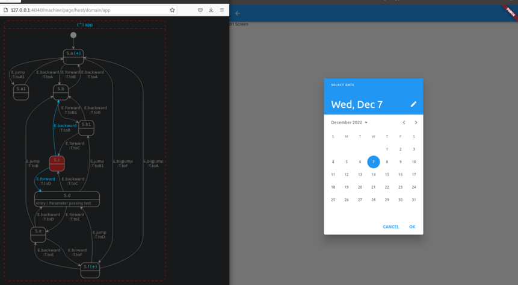

# hisma_flutter_discovery_app

A Flutter application that was created to manually test the [hisma_flutter](../../packages/hisma_flutter/) package. It creates a complex hierarchical state machine and maps it to various ui elements (screens, overlay screens, dialogs).

See it in action with [visma](../../packages/visma/):

## Additional information

If you have any questions, comments please go to [Hisma GitHub Discussions](https://github.com/tamas-p/hisma/discussions) to start or join discussions.
