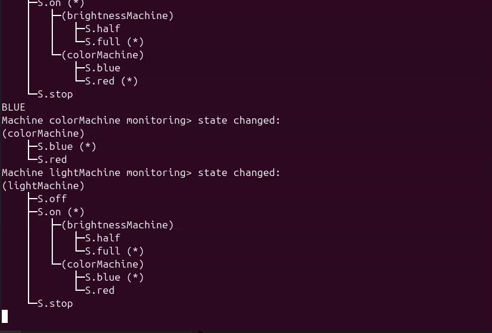

<!--
This README describes the package. If you publish this package to pub.dev,
this README's contents appear on the landing page for your package.

For information about how to write a good package README, see the guide for
[writing package pages](https://dart.dev/guides/libraries/writing-package-pages).

For general information about developing packages, see the Dart guide for
[creating packages](https://dart.dev/guides/libraries/create-library-packages)
and the Flutter guide for
[developing packages and plugins](https://flutter.dev/developing-packages).
-->

Simple monitor implementation for the Hisma package.

## Features

Prints out to console (or onto anything else you define. e.g. a logger) the active states of the hierarchical state machines of the program:



## Getting started

Create your state machines with hisma.

## Usage

You can enable [ConsoleMonitor] by adding a creator function that returns ConsoleMonitor to the list of monitor creators (example code from hisma examples):

```dart
Future<void> main() async {
  Machine.monitorCreators = [
    (machine) => ConsoleMonitor(machine),
  ];

  await lightMachine.start();
  play();
}
```

This will result that state machine creation and active state changes will be monitored by ConsoleMonitor, writing out all active states of all hierarchical state machines of the program.

One can easily modify how [ConsoleMonitor] prints out the active states, e.g. you can use your logger instead of printing to consoles.
In the following example we add an extra separator line before each output of active states:

```dart
Future<void> main() async {
  Machine.monitorCreators = [
    (machine) => ConsoleMonitor(
          machine,
          printer: (str) {
            print('-MONITOR----------------------------');
            print(str);
          },
        ),
  ];

  await lightMachine.start();
  play();
}
```

## Additional information

If you have any questions, comments please go to [Hisma GitHub Discussions](https://github.com/tamas-p/hisma/discussions) to start or join discussions.
