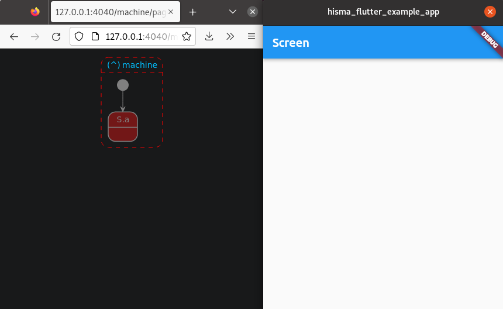

<!--
This README describes the package. If you publish this package to pub.dev,
this README's contents appear on the landing page for your package.

For information about how to write a good package README, see the guide for
[writing package pages](https://dart.dev/guides/libraries/writing-package-pages).

For general information about developing packages, see the Dart guide for
[creating packages](https://dart.dev/guides/libraries/create-library-packages)
and the Flutter guide for
[developing packages and plugins](https://flutter.dev/developing-packages).
-->

## Flutter navigation with [Hisma](../hisma/) hierarchical state machines.

State machines can very well describe your workflow, roaming from screens to screens and dialogs as the active state of the machine changes. Furthermore a hierarchical state machine can even describe interconnected workflows defined in child state machines. This package provides the functionality of this, mapping [hisma](../hisma/) state machine states to ui elements such as screens and dialogs.

## Features

- Mapping screens to states
- Mapping overlay screens to states
- Mapping dialogs (or any imperatively created ui elements) to states
- Hierarchy support - nested navigation

See it in action in the [fb_auth_hisma_example](../../examples/fb_auth_hisma_example/) app that maps screens and dialogs to a `hisma` hierarchical state machine which implements authentication, user management workflows with Firebase Authentication:


## Usage

### Minimal app with a single page ([01_minimal.dart](../../examples/hisma_flutter_example_app/lib/01_minimal.dart))

Let's create the most basic single screen hisma_flutter application possible: Single state machine with a single state declared and a single screen mapped to this state.

First declare the state machine:

```dart
enum S { a }

enum E { e1 }

enum T { t1 }

final machine = NavigationMachine<S, E, T>(
  initialStateId: S.a,
  name: 'machine',
  states: {
    S.a: hisma.State(),
  },
  transitions: {},
);
```

Next step we define the single screen we will use in this application:

```dart
class Screen extends StatelessWidget {
  const Screen({super.key});

  @override
  Widget build(BuildContext context) {
    return Scaffold(
      appBar: AppBar(title: const Text('Screen')),
    );
  }
}
```

Map this screen to the above declared state (stateId to be precise):

```dart
final hismaRouterGenerator = HismaRouterGenerator<S, E>(
  machine: machine,
  mapping: {S.a: MaterialPageCreator<E, void>(widget: const Screen())},
);
```

Finally we shall use this router generator in to configure the
main Widget, the MaterialApp widget:

```dart
class MyApp extends StatelessWidget {
  const MyApp({super.key});

  @override
  Widget build(BuildContext context) {
    return MaterialApp.router(
      routerDelegate: hismaRouterGenerator.routerDelegate,
      routeInformationParser: hismaRouterGenerator.routeInformationParser,
    );
  }
}
```

Don't forget to start the state machine before you invoke [runApp]:

```dart
Future<void> main() async {
  hisma.Machine.monitorCreators = [
    (m) => VisualMonitor(m),
  ];

  await machine.start();
  runApp(const MyApp());
}
```

If you start this application you will see that the above declared Screen is shown. If you use `visma` to visualize your state machine you will see that the state machine is started and that its initial (and single) state is active.

`visma` and app side by side:



### Simple app with three pages ([02_simple.dart](../../examples/hisma_flutter_example_app/lib/02_simple.dart))

Do a baby step and create a state machine with three states (a, b, c) and create three screens (ScreenA, ScreenB and ScreenC) those we map to the states.

As in the previous example, first declare the state machine:

```dart
enum S { a, b, c }

enum E { forward, backward }

enum T { toA, toB, toC }

final machine = NavigationMachine<S, E, T>(
  events: E.values,
  initialStateId: S.a,
  name: 'machine',
  states: {
    S.a: hisma.State(
      etm: {
        E.forward: [T.toB],
      },
    ),
    S.b: hisma.State(
      etm: {
        E.forward: [T.toC],
        E.backward: [T.toA],
      },
    ),
    S.c: hisma.State(
      etm: {
        E.backward: [T.toB],
      },
    ),
  },
  transitions: {
    T.toA: hisma.Transition(to: S.a),
    T.toB: hisma.Transition(to: S.b),
    T.toC: hisma.Transition(to: S.c),
  },
);
```

Then we define the screens. The createButtonsFromStates() utility function helps as to add a column of buttons to all possible events than can be fired from the listed state(s).

```dart
class ScreenA extends StatelessWidget {
  const ScreenA({super.key});

  @override
  Widget build(BuildContext context) {
    return Scaffold(
      appBar: AppBar(title: const Text('ScreenA')),
      body: createButtonsFromStates([machine.states[S.a]]),
    );
  }
}

class ScreenB extends StatelessWidget {
  const ScreenB({super.key});

  @override
  Widget build(BuildContext context) {
    return Scaffold(
      appBar: AppBar(title: const Text('ScreenB')),
      body: createButtonsFromStates([machine.states[S.b]]),
    );
  }
}

class ScreenC extends StatelessWidget {
  const ScreenC({super.key});

  @override
  Widget build(BuildContext context) {
    return Scaffold(
      appBar: AppBar(title: const Text('ScreenC')),
      body: createButtonsFromStates([machine.states[S.c]]),
    );
  }
}
```

Finally mapping screens to states:

```dart
final hismaRouterGenerator = HismaRouterGenerator<S, E>(
  machine: machine,
  mapping: {
    S.a: MaterialPageCreator<E, void>(widget: const ScreenA()),
    S.b: MaterialPageCreator<E, void>(widget: const ScreenB()),
    S.c: MaterialPageCreator<E, void>(widget: const ScreenC()),
  },
);
```

Since the MyApp widget and the main function are exactly the same as in the previous example (and will be the same for all examples) I do not repeat them here and in the coming examples.

Run the app and if you use `visma` too you will see something similar:


As we see in the animation above, firing events will result state changes and state changes will result navigating from screen to screen in the application.

### Using overlay pages ([03_overlay.dart](../../examples/hisma_flutter_example_app/lib/03_overlay.dart))

In the previous example the pages were not stacked on each other, contrary, they replaced each other in Navigator pages. In this section we simply use a different creator class when mapping out screens to stack ScreenC on ScreenB and ScreenB on ScreenA. As we will see this stacking also result that the AppBar will automatically have a back button in the top left corner.

Highlight here only the difference compared to our previous example, the mapping of screens to states:

```dart
final hismaRouterGenerator = HismaRouterGenerator<S, Widget, E>(
  machine: machine,
  creators: {
    S.a: MaterialPageCreator<S>(widget: const ScreenA()),
    S.b: OverlayMaterialPageCreator<S, E>(
      widget: const ScreenB(),
      event: E.backward,
    ),
    S.c: OverlayMaterialPageCreator<S, E>(
      widget: const ScreenC(),
      event: E.backward,
    ),
  },
);
```

In the previous example we only used the simple MaterialPageCreator that only had one argument, the screen we mapped to the state. The here used OverlayMaterialPageCreator is more complex than that by one argument: passing the event id that we want to be triggered if the user presses the framework generated back button in the AppBar.

> **_NOTE:_** Overlay pages, as name suggest, must be stacked over a normal page. Always make sure that your mapping includes at least one normal page mapping for the state that is first activated in the state machine. If you forget to do so in debug mode an assert will fail.

Run the app and if you also use `visma` you will see something similar:


### Dialogs ([04_pageless.dart](../../examples/hisma_flutter_example_app/lib/04_pageless.dart))

Flutter distinguishes pageful and pageless routes. Pageful routes we saw in our examples so far represent changing the whole visual representation of the application - a page. Pageless routes on the other side show visuals on top a pageful route. Just to name two such examples: dialogs, snackbars.

> **Comment** Mapping states to ui with Navigator 2.0 would be easy if there was no pageless routes. Handling those pageless routes declaratively requires workarounds. I hope Flutter will introduce a unified strategy (all declarative including dialogs etc.) at some point in the future and workarounds could be removed from [HismaRouterDelegate].

In this section we will extend the state machine we used so far with two states: b1 is going to represent a AboutDialog and c1 is going to represent a [DatePicker].

First let's declare this new state machine:

```dart
enum S { a, b, b1, c, c1 }

enum E { forward, show, backward }

enum T { toA, toB, toB1, toC, toC1 }

final machine = NavigationMachine<S, E, T>(
  events: E.values,
  initialStateId: S.a,
  name: 'machine',
  states: {
    S.a: hisma.State(
      etm: {
        E.forward: [T.toB],
      },
    ),
    S.b: hisma.State(
      etm: {
        E.forward: [T.toC],
        E.backward: [T.toA],
        E.show: [T.toB1],
      },
      onEntry: getAction(),
    ),
    S.b1: hisma.State(
      etm: {
        E.backward: [T.toB],
      },
    ),
    S.c: hisma.State(
      etm: {
        E.backward: [T.toB],
        E.show: [T.toC1],
      },
      onEntry: getAction(),
    ),
    S.c1: hisma.State(
      etm: {
        E.backward: [T.toC],
      },
    ),
  },
  transitions: {
    T.toA: hisma.Transition(to: S.a),
    T.toB: hisma.Transition(
      to: S.b,
    ),
    T.toB1: hisma.Transition(to: S.b1),
    T.toC: hisma.Transition(to: S.c),
    T.toC1: hisma.Transition(to: S.c1),
  },
);

hisma.Action getAction() => hisma.Action(
      description: 'Print out argument passed.',
      action: (machine, dynamic arg) async =>
          print('Arg passed: $arg'),
    );

```

As we see we introduced the new b1 and c1 states, added a new `show` event that we will use to move to these new states and of course we added the required transitions.

Action objects are added to b and c states as `onEntry` actions. This is to print out the argument passed as return values from the AboutDialog or the DatePicker.

Our screens remain the same as before. We add two new functions that are responsible to create the two dialogs, first the AboutDialog:

```dart
Future<bool?> b1(BuildContext context) => showDialog<bool>(
      context: context,
      builder: (BuildContext context) {
        return AlertDialog(
          title: const Text('Simple AlertDialog'),
          content: const Text('Hello'),
          actions: <Widget>[
            TextButton(
              child: const Text('OK'),
              onPressed: () {
                Navigator.of(context).pop(true);
              },
            ),
          ],
        );
      },
    );
```

then the DatePicker:

```dart
Future<DateTime?> c1(BuildContext context) => showDatePicker(
      context: context,
      firstDate: DateTime(2021),
      initialDate: DateTime.now(),
      currentDate: DateTime.now(),
      lastDate: DateTime(2028),
    );
```

and finally we extend our ui to state mapping:

```dart
final hismaRouterGenerator = HismaRouterGenerator<S, Widget, E>(
  machine: machine,
  creators: {
    S.a: MaterialPageCreator<S>(widget: const ScreenA()),
    S.b: OverlayMaterialPageCreator<S, E>(
      widget: const ScreenB(),
      event: E.backward,
    ),
    S.b1: PagelessCreator(show: b1, event: E.backward),
    S.c: OverlayMaterialPageCreator<S, E>(
      widget: const ScreenC(),
      event: E.backward,
    ),
    S.c1: PagelessCreator(show: c1, event: E.backward),
  },
);
```

We are using a new creator, the [PagelessCreator]. It expects a show function and an event that will be used in case of the pageless route is popped.

Run the app and if you also use `visma` you will see something similar:


### Utility states ([05_no_ui_update.dart](../../examples/hisma_flutter_example_app/lib/05_no_ui_update.dart))

In some cases you want your state not to be mapped to a screen or dialog (or any ui element in general). For example you want to put network fetching functionality to a utility state that will do its job then state will return to the previous state. In this case we do not want the UI to be updated and we explicitly doing it so by mapping this utility state to a special creator the [NoUIChange] creator.

Let's extend our state machine further with the b1 state that will emulate fetching of weather data from the network. This will be triggered by the new fetch event.

```dart
    S.b2: hisma.State(
      etm: {
        E.backward: [T.toBFromB2],
      },
      onEntry: hisma.Action(
        description: 'Fetch weather report.',
        action: (machine, dynamic arg) async {
          Future<void>.delayed(const Duration(seconds: 1), () {
            print('Weather data is fetched.');
            machine.fire(E.backward, data: 'Sunny weather.');
          });
        },
      ),
    ),
```

The onEntry action of the `b2` state will emulate the weather data fetch and when completed it prints out the weather data and then fires the backward event (with data set to the weather data) to get the state machine back to its previous state.

```dart
    T.toBFromB2: hisma.Transition(
      to: S.b,
      onAction: hisma.Action(
        description: 'Weather info received.',
        action: (machine, dynamic arg) async {
          print('Weather info received: $arg');
        },
      ),
    ),
```

The toBFromB2 transition is that takes us back from the `b2` state to the `b` state. We declare an onAction action that prints out the weather data received as argument to the fire event.

The state to ui mapping is now includes `b2`:

```dart
final hismaRouterGenerator = HismaRouterGenerator<S, Widget, E>(
  machine: machine,
  creators: {
    S.a: MaterialPageCreator<S>(widget: const ScreenA()),
    S.b: OverlayMaterialPageCreator<S, E>(
      widget: const ScreenB(),
      event: E.backward,
    ),
    S.b1: PagelessCreator(show: b1, event: E.backward),
    S.b2: NoUIChange(),
    S.c: OverlayMaterialPageCreator<S, E>(
      widget: const ScreenC(),
      event: E.backward,
    ),
    S.c1: PagelessCreator(show: c1, event: E.backward),
  },
);
```

Run the app and if you also use `visma` you will see something similar. Check out the fetch event from `b`. You will see that temporarily (for one second) the active state becomes `b2` but that do not result any UI change:


### Adding hierarchy ([06_hierarchical.dart](../../examples/hisma_flutter_example_app/lib/06_hierarchical.dart))

Our state machine can be hierarchical, so does our navigation. If a state includes a region we can simply map it to a Router widget and set its routerDelegate with the help of [HismaRouterGenerator] on the state machine of the region:

```dart
    S.compound: MaterialPageCreator<S>(
      widget: Router(routerDelegate: hismaRouterGenerator.routerDelegate),
    ),
```

Let's have a look closer to this by further extending our example: Assume that at this stage our application is functionality wise ready but it lacks authentication. We could start adding user management related states to our existing machine representing login screen, registration, asking password reset etc. This would create mess quickly as all these user management related functionalities has nothing to do with the core functionalities of our application hence would be better keep them as separated as possible: Put the authentication, user management related activities into its own state machine and add the main state machine of our application to one of the states of this newly created machine.

In order to keep our example as simple as possible this authentication state machine will include only two states: signedOut and signedIn and the signIn and signOut events will trigger transitioning between them:

```dart
enum AS { signedIn, signedOut }

enum AE { signIn, signOut }

enum AT { toSignedIn, toSignedOut }

final authMachine = NavigationMachine<AS, AE, AT>(
  events: AE.values,
  name: 'authMachine',
  initialStateId: AS.signedOut,
  states: {
    AS.signedOut: hisma.State(
      etm: {
        AE.signIn: [AT.toSignedIn],
      },
    ),
    AS.signedIn: hisma.State(
      etm: {
        AE.signOut: [AT.toSignedOut],
      },
      regions: [
        hisma.Region<AS, AE, AT, S>(machine: machine),
      ],
    ),
  },
  transitions: {
    AT.toSignedOut: hisma.Transition(to: AS.signedOut),
    AT.toSignedIn: hisma.Transition(to: AS.signedIn),
  },
);
```

As you see we also added our existing state machine (named `machine`) from the previous example application as a region of the `signedIn` state.

For the signedOut state we create a new screen, we can call it as LoginScreen:

```dart
class LoginScreen extends StatelessWidget {
  const LoginScreen({super.key});

  @override
  Widget build(BuildContext context) {
    return Scaffold(
      appBar: AppBar(title: const Text('LoginScreen')),
      body: createButtonsFromStates([authMachine.states[AS.signedOut]]),
    );
  }
}
```

As a last step we create the mapping in [HismaRouterGenerator] for the authMachine:

```dart
final authRouterGenerator = HismaRouterGenerator<AS, Widget, AE>(
  machine: authMachine,
  creators: {
    AS.signedOut: MaterialPageCreator<AS>(widget: const LoginScreen()),
    AS.signedIn: MaterialPageCreator<AS>(
      widget: Router(routerDelegate: hismaRouterGenerator.routerDelegate),
    ),
  },
);
```

The rest is identical with the precious example application. As we see above we simply use its hismaRouterGenerator.routerDelegate as argument for the [Router] in our mapping for the signedIn state.

Run the app and if you also use `visma` you will see something similar as the animated gif shows bellow.


## Additional information

If you have any questions, comments please go to [Hisma GitHub Discussions](https://github.com/tamas-p/hisma/discussions) to start or join discussions.
