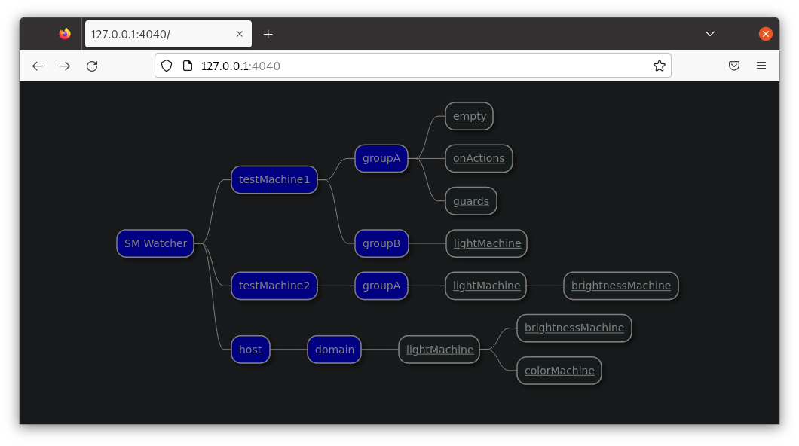

<!--
This README describes the package. If you publish this package to pub.dev,
this README's contents appear on the landing page for your package.

For information about how to write a good package README, see the guide for
[writing package pages](https://dart.dev/guides/libraries/writing-package-pages).

For general information about developing packages, see the Dart guide for
[creating packages](https://dart.dev/guides/libraries/create-library-packages)
and the Flutter guide for
[developing packages and plugins](https://flutter.dev/developing-packages).
-->

Visual monitor for Hisma, a hierarchical state machine implementation.

Hisma defines a monitoring API: One can register monitor creator functions and the monitors created by these will be invoked by Hisma when the state machines are created or their active state changes.

This monitor is a visual monitor implementation for hisma. It transforms and then sends state machine information to its counterpart, the [visma](../visma/) application. [visma](../visma/) in turn renders these state machines to its interactive web user interface.

## Features

See `hisma_visual_monitor` in action using [visma](../visma/) and an actual Flutter (example) application side-by-side. Note that left side rendered state machine diagrams are updated regardless the event triggering the state machine change was initiated from the application or from the [visma](../visma/) user interface:


## Getting started

Create your `hisma` state machines that you want to monitor.

## Usage

Practically right at the beginning of your program in the main function set visual monitor creator for the [StateMachine]:

```dart
StateMachine.monitorCreators = [
  (machine) => VisualMonitor(machine),
];
```

This [VisualMonitor] will connect to [visma](../visma/) listening at the localhost on its default port (4020).

You can also connect to a [visma](../visma/) instance listening on a different port or even at a remote host:

```dart
StateMachine.monitorCreators = [
    (machine) => VisualMonitor(
          machine,
          host: '192.168.1.2',
          port: 1111,
        ),
  ];
```

Furthermore as [visma](../visma/) state machine overview page will organize machines into hierarchy not only based in their position in the state machine hierarchy, but also the [hostname] and [domain] of their [VisualMonitor], it is possible to set these to something else (any string) than their default values (and those are _"localhost"_ and _"domain"_ respectively):

```dart
VisualMonitor.hostname = 'testMachine1';
VisualMonitor.domain = 'groupA';
```

This allows organizing your state machines into two hierarchy levels at the top. In this image we see the [visma](../visma/) overview page showing that those state machines visualized are coming from three sources (_"testMachine1"_, _"testMachine2"_ and _"host"_) and they are further organized into domains (_"groupA"_, _"groupB"_ and _"domain"_):



## Additional information

If you have any questions, comments please go to [Hisma GitHub Discussions](https://github.com/tamas-p/hisma/discussions) to start or join discussions.
