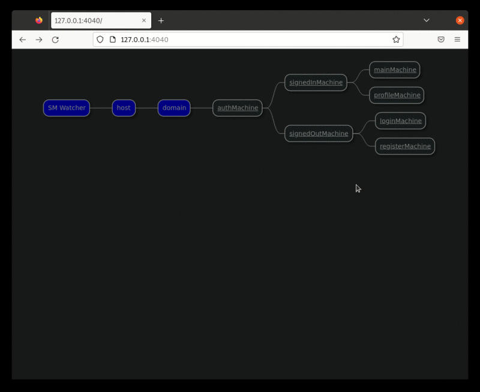

<!--
This README describes the package. If you publish this package to pub.dev,
this README's contents appear on the landing page for your package.

For information about how to write a good package README, see the guide for
[writing package pages](https://dart.dev/guides/libraries/writing-package-pages).

For general information about developing packages, see the Dart guide for
[creating packages](https://dart.dev/guides/libraries/create-library-packages)
and the Flutter guide for
[developing packages and plugins](https://flutter.dev/developing-packages).
-->

Visma is visualizing state machines.

This package can install a command line tool called `visma` that renders hierarchical state machines created with the [hisma](../hisma/) package to interactive state machine diagrams. It gets state machine status updates from its counterpart hisma monitor called [hisma_visual_monitor](../hisma_visual_monitor/) and renders them to interactive web pages with the help of the [pumli](https://github.com/tamas-p/pumli) package.

## Features

### State machines overview page



### State machine pages


### Visma does not only monitor, you can also fire events from visma ui:


## Getting started

### Prerequisites

As stated in the first paragraph, visma is using PlantUML, hence PlantUML is a prerequisite for visma. See https://plantuml.com/starting for PlantUML installation details.
Prefer using PlantUML [V1.2022.1](https://sourceforge.net/projects/plantuml/files/1.2022.1/) as described in [pumli](https://github.com/tamas-p/pumli) (visma internally uses the pumli package to render state machine diagrams).

### Installing visma

If PlantUML and its prerequisites (Java, Graphviz) are installed you can install visma as follows:

```bash
$ dart pub global activate visma
```

> **Note** In order to simplify visma installation, a docker container of visma
> with preinstalled prerequisites is in the make.

## Usage

You can check visma command line parameters:

```
$ visma -h
A visualization server for Hisma the hierarchical state machine.
Without parameters it will try running the 'plantuml -picoweb' command as the renderer for visma.

Usage: visma [--bind=BIND] [--port=PORT] [--plantuml_public] | [--plantuml_url=URL] | [--plantuml_jar=JAR --plantuml_bind=BIND --plantuml_port=PORT] [--help]

Options:
-p, --port               Port of the visma service listening on.
-b, --bind               Specify bind address of the visma service.
    --plantuml_public    The public PlantUML service will be used as renderer.
    --plantuml_url       PlantUML service at this URL will be used to render.
    --plantuml_port      Port of the PlantUML renderer service that will be started.
    --plantuml_jar       Specify PlantUML jar location.
    --plantuml_bind      Specify bind address of the local PlantUML service to be started.
-h, --help               Shows this help.
```

### Examples

#### Simple start from cmd, default parameters

```
$ visma
"plantuml -picoweb:4020:127.0.0.1":
webPort=4020
```

#### Start from cmd, using specific plantuml jar

```
$ visma --plantuml_jar files/plantuml/plantuml.1.2022.1.jar
"java -jar, files/plantuml/plantuml.1.2022.1.jar, -Djava.net.useSystemProxies=true, -picoweb:4020:127.0.0.1":
webPort=4020

INFO: 2022-12-31 13:41:31.163360: visma.VisualizationServer: SM PlantUML visualization server stated on InternetAddress('127.0.0.1', IPv4):4040
```

Finally, use [hisma_visual_monitor](../hisma_visual_monitor/) to send state machine updates to visma.

## Additional information

If you have any questions, comments please go to [Hisma GitHub Discussions](https://github.com/tamas-p/hisma/discussions) to start or join discussions.
